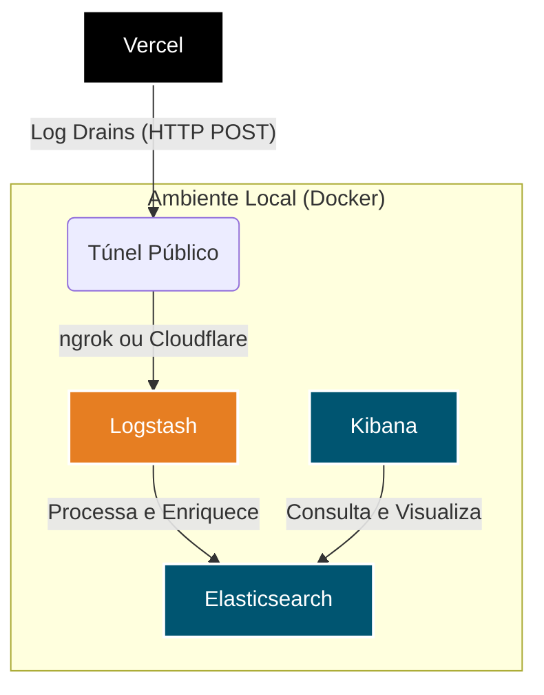

    <div align="center">

# 🛡️ SIEM com Elastic Stack para Logs da Vercel 🛡️

**Um sistema simplificado de SIEM (Security Information and Event Management) para monitorar a segurança e o desempenho de aplicações Vercel em tempo real.**

</div>


Este projeto utiliza o **Elastic Stack** (Elasticsearch, Logstash e Kibana) para coletar, processar, armazenar e visualizar logs de aplicações hospedadas na Vercel, criando um dashboard centralizado para monitoramento de eventos, identificação de padrões e análise de segurança.

---

## ✨ Principais Funcionalidades

*   **Coleta em Tempo Real**: Recebe logs da Vercel via Log Drains.
*   **Processamento e Enriquecimento**: O pipeline do Logstash faz o parsing dos logs, extrai o IP do cliente, enriquece os dados com geolocalização (país, cidade, coordenadas) e corrige o timestamp.
*   **Armazenamento Centralizado**: Utiliza o Elasticsearch para armazenar e indexar os logs de forma eficiente.
*   **Visualização Interativa**: Permite a criação de dashboards e visualizações dinâmicas no Kibana para análise de segurança e performance.
*   **Ambiente Containerizado**: Todo o stack é orquestrado com Docker Compose, facilitando a configuração e a execução.

## 🏗️ Arquitetura

O fluxo de dados foi desenhado para ser simples e eficiente:



1.  **Vercel**: Gera logs de acesso e de funções para uma aplicação.
2.  **Log Drains**: A Vercel envia esses logs em tempo real via HTTP POST para uma URL pública.
3.  **Túnel (ngrok/Cloudflare)**: Uma ferramenta de túnel expõe o serviço Logstash local para a internet, fornecendo a URL pública necessária.
4.  **Logstash**: Recebe os logs brutos, os processa e os envia para o Elasticsearch.
5.  **Elasticsearch**: Armazena e indexa os logs para busca e análise.
6.  **Kibana**: Conecta-se ao Elasticsearch para exploração dos dados e criação de dashboards.

## 🚀 Como Começar

### 📋 Pré-requisitos

*   Docker e Docker Compose instalados.
*   Uma conta na Vercel com um projeto ativo.
*   Uma ferramenta de túnel como ngrok ou Cloudflare Tunnel.

### ⚙️ Configuração e Execução

1.  **Clone o Repositório**
    ```bash
    git clone gestao_atipicos-siem
    cd gestao_atipicos-siem
    ```

2.  **Exponha o Logstash**
    O Logstash irá escutar na porta `8080`. Exponha essa porta para a internet usando sua ferramenta de túnel preferida.
    ```bash
    # Exemplo com Cloudflare Tunnel (recomendado pelo MANUAL.md)
    cloudflared tunnel --url http://localhost:8080
    ```
    Copie a URL `https` fornecida pela ferramenta (ex: `https://random-words.trycloudflare.com`).

3.  **Configure o Vercel Log Drains**
    No dashboard do seu projeto na Vercel, vá para **Settings > Log Drains**, selecione o formato **JSON** e cole a URL obtida no passo anterior.

4.  **Inicie o Elastic Stack**
    Com o Docker em execução, suba os contêineres:
    ```bash
    docker-compose up -d
    ```

5.  **Acesse o Kibana**
    Abra o navegador e acesse `http://localhost:5601`. Pode levar alguns minutos para o Kibana estar totalmente operacional.

## 🔧 Pipeline do Logstash

O arquivo de configuração `logstash/pipeline/vercel.conf` define o pipeline de processamento:

*   **Input**: Recebe logs via HTTP na porta `8080`.
*   **Filtros**:
    *   Extrai o endereço de IP do cliente (`[proxy][clientIp]`).
    *   Utiliza o filtro `geoip` para enriquecer o log com dados de geolocalização.
    *   Converte o timestamp da Vercel (em milissegundos) para o formato de data padrão do Elastic.
*   **Output**: Envia os dados processados para um índice diário no Elasticsearch (`vercel-gemini-%{+YYYY.MM.dd}`).

## 📊 Visualizando os Dados

Após a ingestão dos primeiros logs, siga estes passos no Kibana:

1.  Vá para **Management > Stack Management > Index Management** para verificar se o índice (`gestao_atipicos_logs-...`) foi criado.
2.  Vá para **Analytics > Discover**. Crie um "Data View" usando o padrão de índice `gestao_atipicos_logs-*`.
3.  Comece a explorar seus logs e a criar visualizações para o seu dashboard!

---

Para um guia mais detalhado sobre a configuração de cada componente, consulte o arquivo **MANUAL.md**.